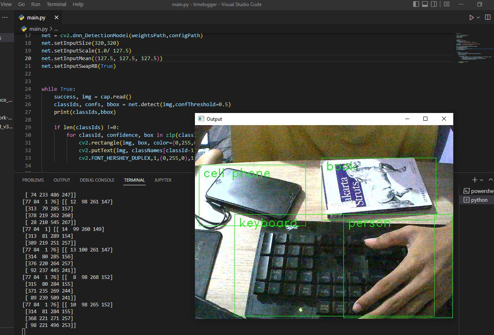

# Real Time Object Detector using opencv-python
ObjectDetector in python

## Introduction
  This project uses OpenCV to perform real-time object detection using a computer webcam.The goal is to detect objects like people, chairs, dogs, and other objects by   
  looping over each frame of the video stream.
  
  Heres the output.
  
  
### How to run this code.
  
**Step 1:** Create a directory in your local machine and cd into it.
```
mkdir ~/Desktop/opencv_project
cd ~/Desktop/opencv_project
```
**Step 2:** Clone the repository and cd into the folder:

```
git clone https://github.com/Kenmanekoma/Real-Time-Object-Detector.git
```

**Step 3:** Install all the necessary libraries. These are some of the libraries I had to install:

```
pip install opencv-python
```

**Step 4:** Make sure you have your video devices connected (e.g. Webcam, FaceTime HD Camera, etc.). 

**Step 5:** To start your video stream and real-time object detection, run the following command in terminal

```
python main.py
```

**Step 6:** Enjoy :)
